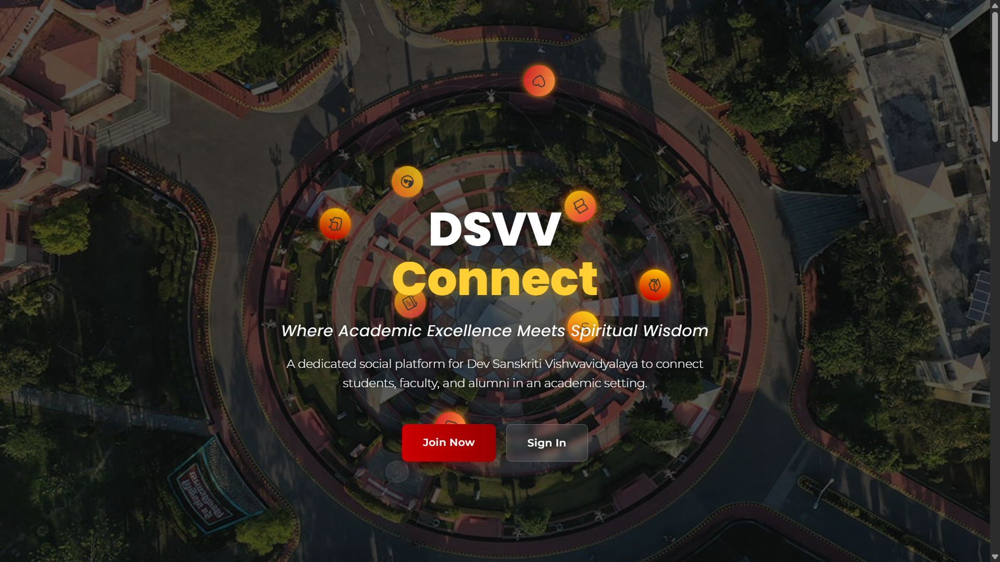

# DSVV Academic Social Networking Site

A specialized social platform for Dev Sanskriti Vishwavidyalaya that connects students, faculty, and alumni in an academic-focused environment.

# Screenshot


## Features

- User authentication with different user types (Student, Faculty, Alumni, Admin)
- Academic portfolios for showcasing achievements and skills
- Discussion forums with faculty verification for quality content
- Academic resources library with curated study materials
- Events calendar for academic events, workshops, and seminars
- Career center with internship and job opportunities
- Alumni network for mentorship and networking
- Wellness center with resources for meditation and yoga
- Sanskar Points system for rewarding positive contributions

## Tech Stack

### Frontend
- React.js with Vite
- Tailwind CSS for styling
- React Router for navigation
- Axios for API requests
- Socket.io for real-time features

### Backend
- Node.js with Express
- MongoDB for database
- JWT for authentication
- Socket.io for real-time features

## Getting Started

### Prerequisites

- Node.js (v14 or higher)
- MongoDB (local or Atlas)

### Installation

1. Clone the repository
```bash
git clone https://github.com/yourusername/academic-social-networking-site.git
cd academic-social-networking-site
```

2. Install backend dependencies
```bash
cd backend
npm install
```

3. Install frontend dependencies
```bash
cd ../frontend
npm install
```

4. Create a `.env` file in the backend directory with the following variables:
```
PORT=5000
NODE_ENV=development
CLIENT_URL=http://localhost:5173
JWT_SECRET=your_jwt_secret_key
MONGODB_URI=mongodb://localhost:27017/dsvv_social_network
```

### Seeding the Database

The project includes sample data for testing and development purposes. To seed the database:

1. Make sure MongoDB is running
2. Run the seeder script:
```bash
cd backend
npm run data:import
```

This will populate the database with:
- User accounts (Students, Faculty, Alumni, Admin)
- Posts
- Events
- Resources
- Forums

To remove all data from the database:
```bash
npm run data:destroy
```

### Sample User Accounts

After seeding the database, you can use the following accounts to test different user roles:

#### Student Accounts
- Email: rahul.sharma@student.dsvv.ac.in
- Password: password123

- Email: priya.patel@student.dsvv.ac.in
- Password: password123

- Email: arjun.singh@student.dsvv.ac.in
- Password: password123

#### Faculty Accounts
- Email: anil.kumar@faculty.dsvv.ac.in
- Password: password123

- Email: sunita.sharma@faculty.dsvv.ac.in
- Password: password123

- Email: rajesh.mishra@faculty.dsvv.ac.in
- Password: password123

#### Alumni Accounts
- Email: vikram.mehta@alumni.dsvv.ac.in
- Password: password123

- Email: meera.joshi@alumni.dsvv.ac.in
- Password: password123

- Email: sanjay.gupta@alumni.dsvv.ac.in
- Password: password123

#### Admin Account
- Email: admin@dsvv.ac.in
- Password: admin123

### Running the Application

1. Start the backend server:
```bash
cd backend
npm run dev
```

2. Start the frontend development server:
```bash
cd frontend
npm run dev
```

3. Open your browser and navigate to `http://localhost:5173`

## User Types and Access Levels

### Student
- Access to academic resources
- Participation in discussion forums
- View and register for events
- Access to career center
- Connect with faculty and alumni

### Faculty
- All student privileges
- Create and verify academic content
- Create and manage events
- Mentor students
- Moderate discussion forums

### Alumni
- All student privileges
- Post job opportunities
- Mentor current students
- Connect with other alumni

### Admin
- Manage all users and content
- System configuration
- Content moderation
- User verification

## License

This project is licensed under the MIT License - see the LICENSE file for details.

## Acknowledgments

- Dev Sanskriti Vishwavidyalaya for inspiration
- All contributors to this project
